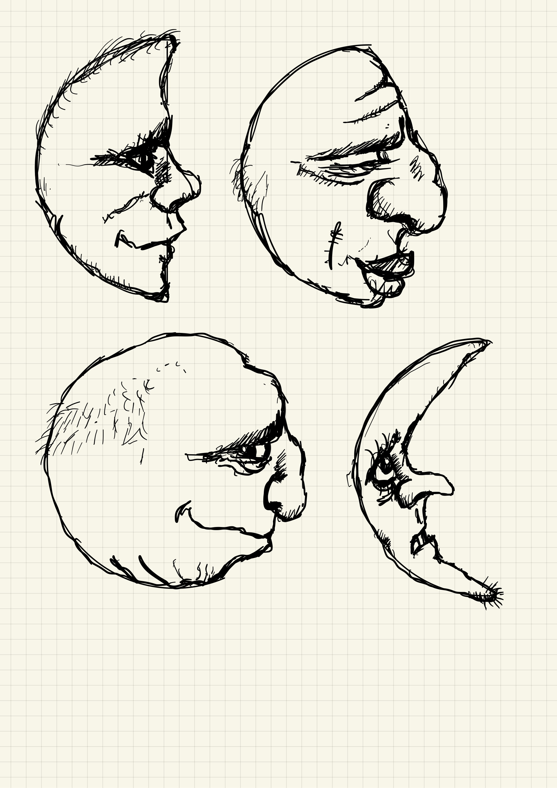
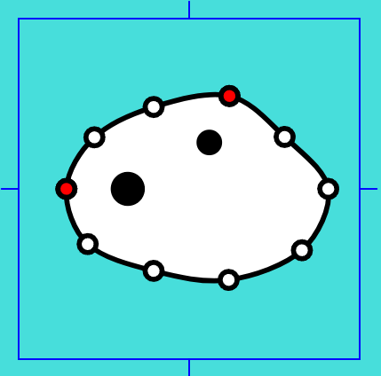

# 2024 MDDN342 Assignment 2: Randomised Collections

## Project Overview

"Randomised Collections" is an artistic exploration inspired by the ethereal spirits known as Kodamas from the movie "Princess Mononoke." This project focuses on generating unique and randomized variations of Kodama-like faces using parametric techniques. Each generated face features distinctive head shapes, eye positions, and mouth placements, creating a diverse collection while retaining a consistent thematic essence.

## Design Process and Implementation

### Initial Inspiration

Initially, the project was inspired by the moon's phases and the idea of incorporating them into the design. However, after considering feasibility, the concept shifted to draw inspiration from the whimsical Kodamas from "Princess Mononoke."

### Parametric Generation of Kodama Faces

The primary challenge was to create randomized blob-like head shapes reminiscent of Kodama spirits. Using a circular base with controlled randomness, I developed a method to generate varied head shapes while maintaining visual coherence.

#### Base Shape Variation

To introduce more diversity among the generated faces, three base shapes were implemented: circular, horizontal oval, and vertical circle. This variation was essential in ensuring each Kodama retains uniqueness while sharing a common visual theme.

#### Eye and Mouth Placement

Eye and mouth placement posed technical challenges due to the randomized nature of head shapes. A method was devised to anchor eyes relative to specific points on the head, ensuring they remain within the facial region regardless of shape variations.

### Background and Visual Aesthetics

#### Leafy Background

The background was designed to evoke the forest setting of the Kodama spirits. Using a leaf-drawing function by thomm238, I created a canopy-like backdrop with randomized leaf rotations and subtle color variations. This backdrop complements the Kodama faces, adding depth and thematic cohesion to the scene.

#### Color Variation and Transparency

Influenced by the movie's aesthetics, the Kodama faces initially featured uniform white coloring. To enhance visual appeal and realism, I introduced subtle color variations ranging from pure white to eggshell. Additionally, a minor transparency effect was applied to some Kodamas, suggesting their ephemeral nature as forest spirits.

### Decisions and Reflections

#### Creative Decisions

I chose to interpret the Kodamas with more whimsical and irregular head shapes compared to their portrayal in "Princess Mononoke." This decision aimed to emphasize diversity and creativity in the generated faces while staying true to the assignment's requirement for variability.

#### Visual Enhancements

Adjustments in color variation and background details were made to prevent visual monotony and enhance overall aesthetic appeal. These enhancements aimed to create a visually engaging experience that resonates with the spirit of the original inspiration.

## Running the Project

To view and interact with "Randomised Collections," follow these steps:

1. **Setup:**
   - Clone the repository to your local machine.

2. **Run the Project:**
   - Navigate to the project directory.
   - Open `index.html` in your preferred web browser or use a tool like Live Server for real-time updates.

3. **Interact:**
   - Once the project is running, explore the generated Kodama faces.
   - Use the provided buttons or controls to interact with and customize the display as desired.

## Additional Notes

- **Assignment Details:** [Review Assignment Due Date](https://classroom.github.com/a/uYb6fuja)
- **Development Environment:** Visual Studio Code with Live Server recommended for real-time updates.

---

This README provides an overview of "Randomised Collections," detailing its design journey, technical implementations, visual decisions, and instructions for running the project. It showcases a blend of artistic interpretation and parametric design, offering a unique exploration into generating varied faces inspired by Kodama spirits.
